# README — Automatisation complète du déploiement et configuration de n8n sur Azure

Ce projet contient désormais 3 scripts Bash distincts et complémentaires : création de la VM Azure, déploiement de n8n sur la VM, puis configuration de n8n via API.

## Création d’un compte Azure for Students

Pour bénéficier des crédits gratuits et des services Azure spécifiques aux étudiants, suivez ces étapes pour créer votre compte Azure for Students :
	
	1.	Rendez-vous sur la page officielle Azure for Students :"https://azure.microsoft.com/fr-fr/free/students"  
	
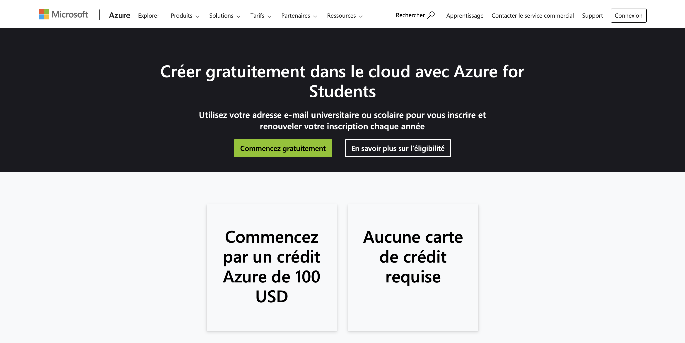

	2.	Connectez-vous avec votre adresse mail scolaire fourni spécifiquement pour ce projet en cliquant sur "COMMENCEZ GRATUITEMENT" :

		- Vous devrez vous connecter avec le compte supdevinci-edu.fr
		- Remplir les formulaires
    	- Prénom
    	- Nom
    	- Pays
    	- Nom de l’établissement scolaire : Sup de Vinci (Bordeaux)
    	- ….
		
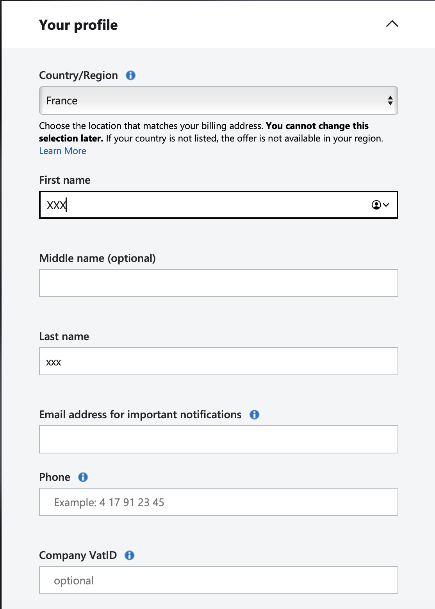

	3.	Complétez le formulaire de vérification d’identité étudiante, validez votre statut en utilisant votre adresse
	mail fourni pour ce projet.
	
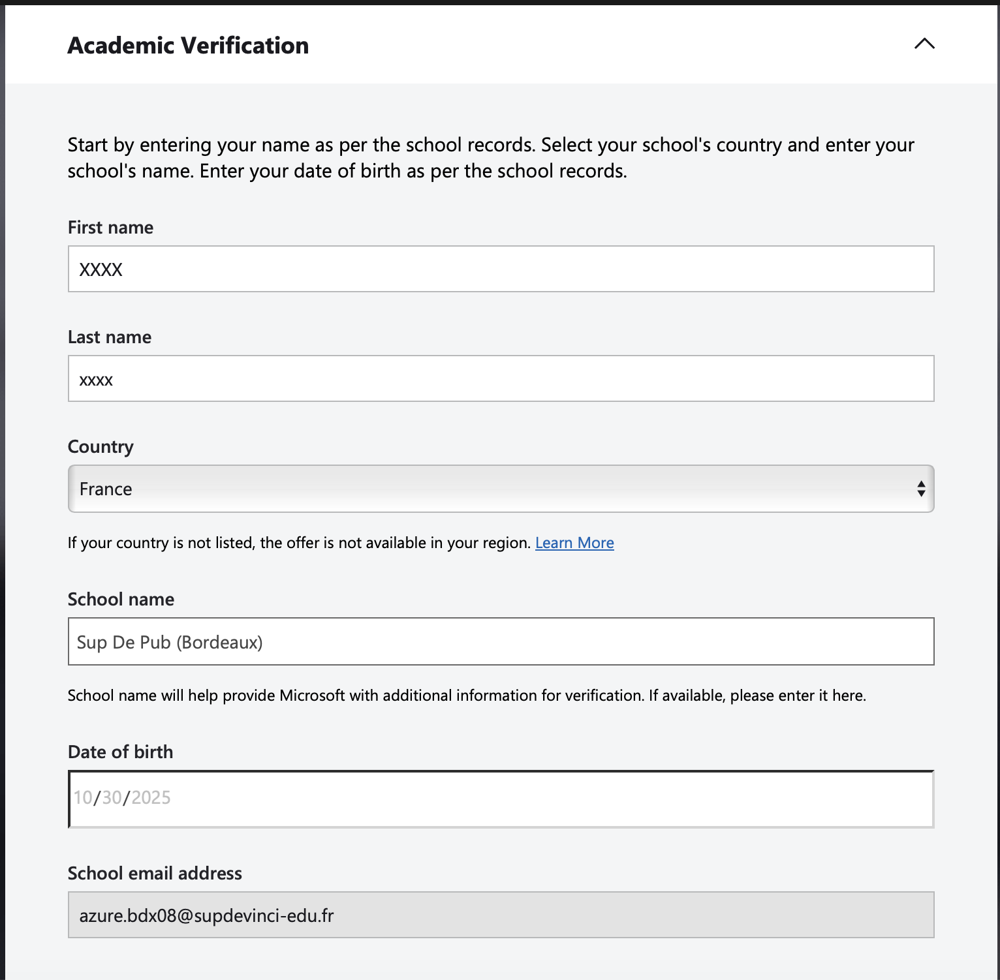

	4. Activez la vérification en deux étapes (2FA) pour renforcer la sécurité de votre compte. 
	Cette étape consiste à configurer une méthode d’authentification supplémentaire, comme 	l’application
	Microsoft Authenticator ou une vérification par téléphone.
	
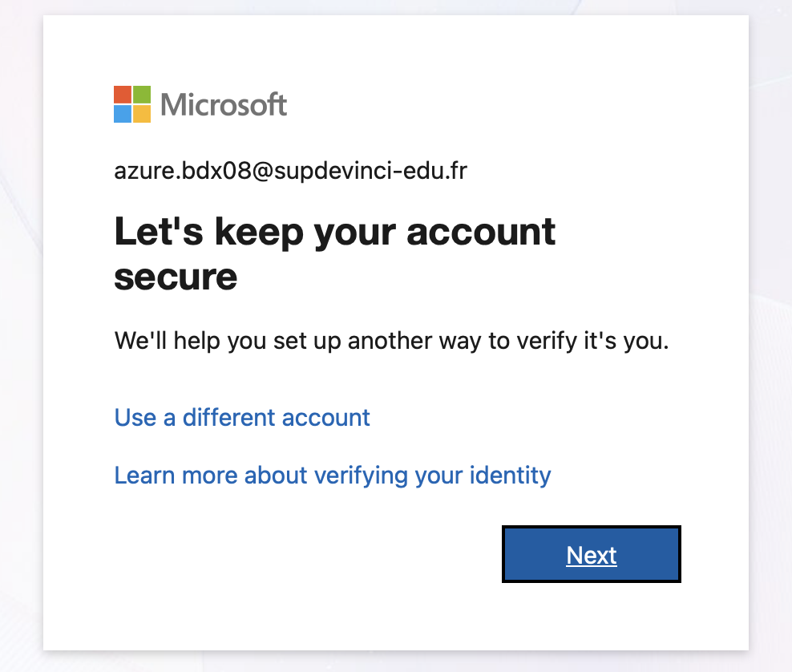
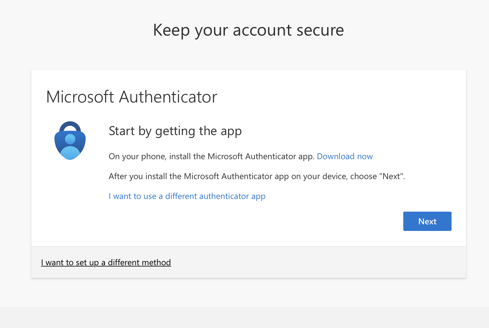
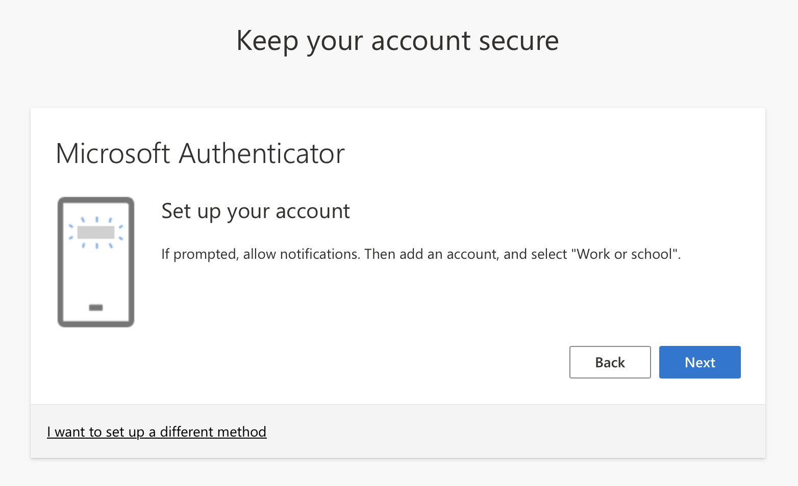
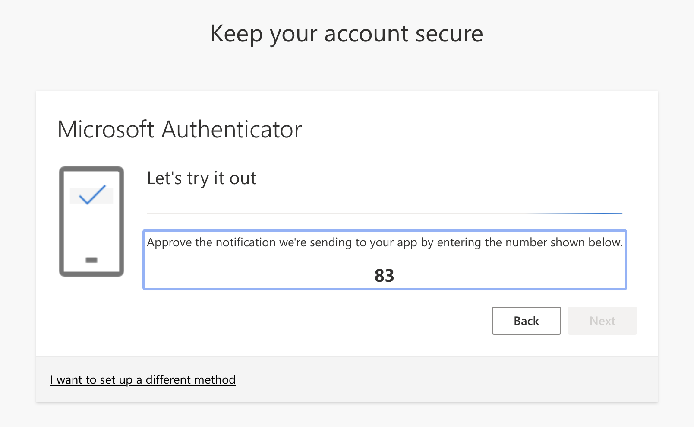
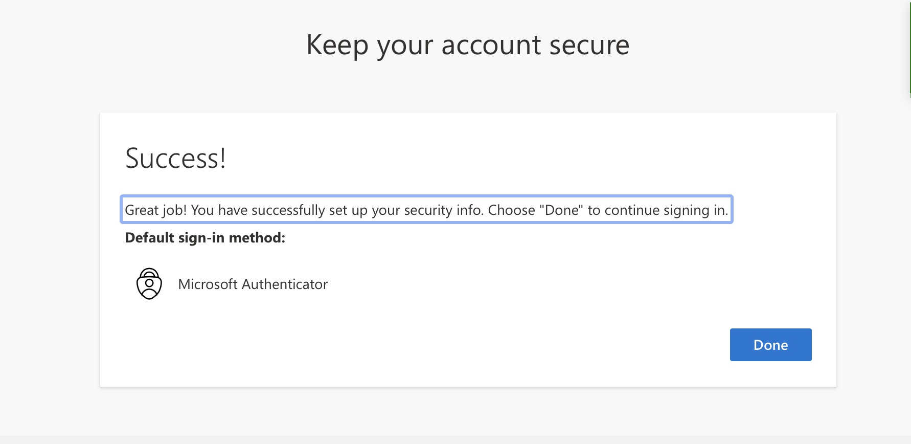

	
	5.	Une fois votre compte vérifié, vous recevrez un crédit gratuit valable 12 mois pour utiliser
	les services Azure. Vous pourrez renouveler cette offre tant que vous êtes étudiant.
	
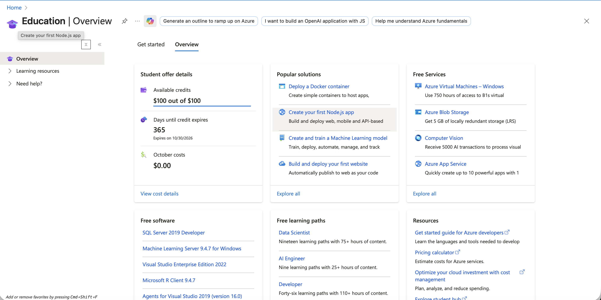

Ces étapes vous permettront d’accéder facilement à un environnement cloud pour vos projets et apprentissages.

---

## Aperçu des scripts

| Script | Description |
|--------|-------------|
| `0_create_vm.sh` | Crée l’infrastructure Azure (RG, réseau, NSG, IP, VM), gère `--start`, `--stop`, `--cleanup` |
| `1_deploy_n8n_azure.sh` | Déploie n8n sur la VM Azure |
| `2_config_n8n.sh` | Configure n8n (owner, clé API, import de workflows) |

---

## Script 1 – Création de la VM Azure (`0_create_vm.sh`)

### Fonctionnalités principales

- Vérifie et installe Azure CLI sur le pc hôte (local) si nécessaire
- Authentifie l'utilisateur sur Azure
- Récupère la liste des régions autorisées via la politique Azure
- Crée les ressources Azure nécessaires (Resource Group, réseau virtuel, sous-réseau, groupes de sécurité)
- Configure les règles du groupe de sécurité pour ouvrir SSH (ports 22) et le port 5678 de n8n
- Génère une paire de clés SSH locale pour la VM (`~/.ssh/azure_n8n`)
- Crée une machine virtuelle Debian 11 avec cloud-init :
  - Installe Docker
  - Lance automatiquement un conteneur n8n avec authentification basique (admin/admin123)
- Attend que le service n8n soit disponible sur le port 5678 de la VM
- Affiche les informations d'accès (IP publique, SSH, credentials par défaut)

### Comment utiliser

1. **Rendre le script exécutable :**
   `chmod +x 0_create_vm.sh`

2. **Lancer le script :**
`./0_create_vm.sh`


3. **Se connecter à Azure** via l'interface ouverte dans le navigateur pour s'authentifier avec le compte fourni spécifiquement pour ce projet
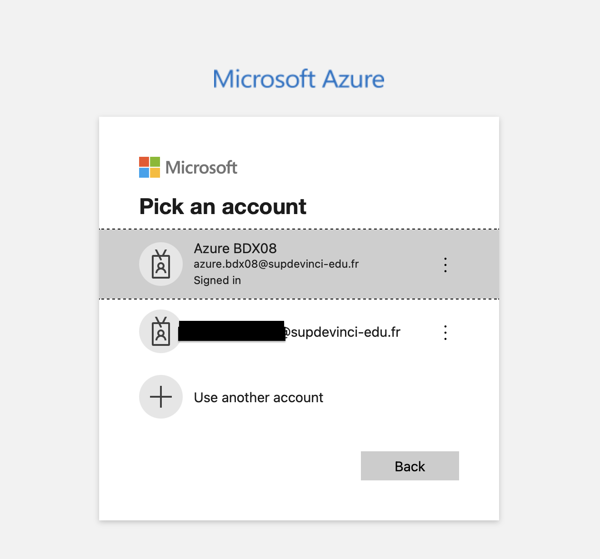
	Retourner dans le terminal et choisissez le compte fourni précédemment, puis cliquez sur "entrée"
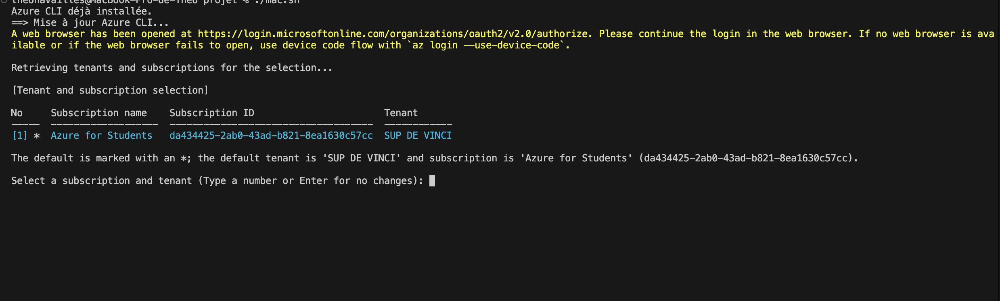


5. Le script s'occupe de tout le déploiement

6. À la fin, il affiche :
- L'adresse IP publique de la machine
- Les accès SSH
- L'URL n8n (ex: `http://<IP>:5678`)

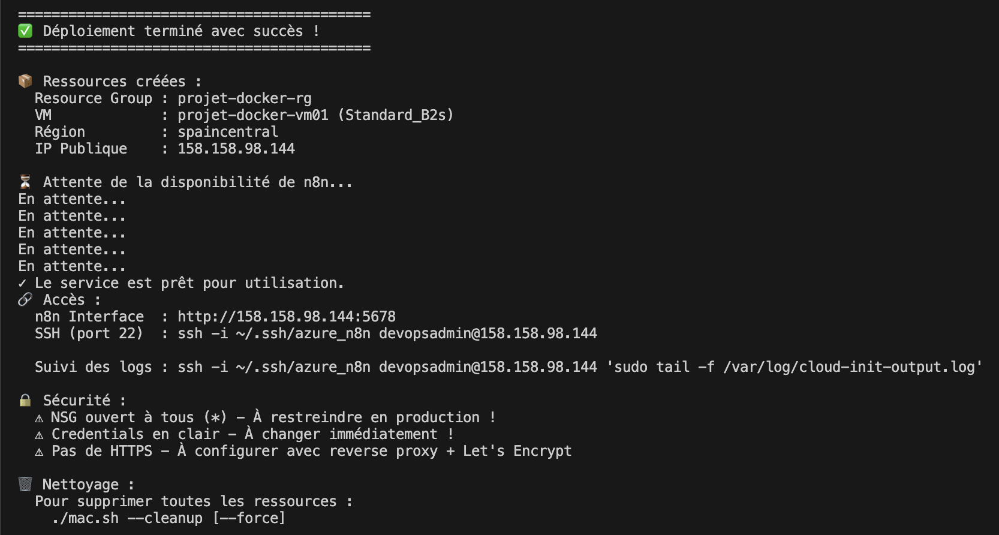

### Arrêt et reprise de l'activité de la Virtual Machine
[Attention cette option ne supprime pas la machine virtuelle, elle continue à être facturée]

Pour stopper la VM temporairement, vous pouvez relancer le script avec l'option `--stop` :

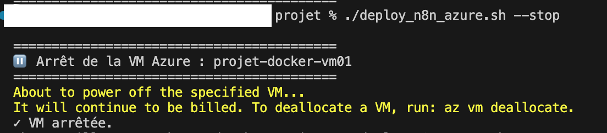

Pour relancer la VM après un arrêt, il faut utiliser l'option `--start`:

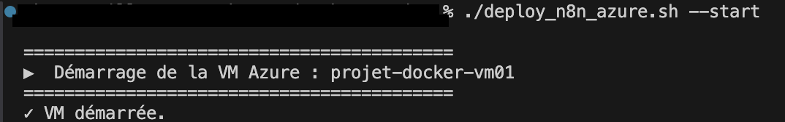


### Nettoyage

Pour supprimer toutes les ressources Azure et les clés SSH associées :
`./0_create_vm.sh --cleanup`

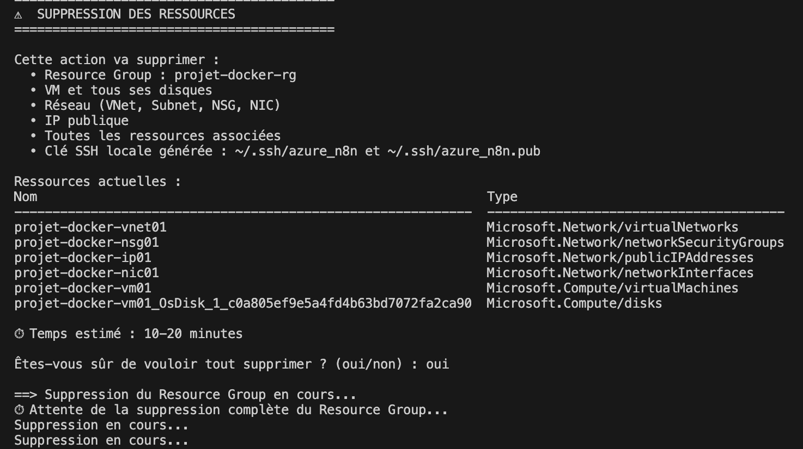

---

## Script 2 – Déploiement n8n sur Azure (`1_deploy_n8n_azure.sh`)

### Objectif

Déployer n8n sur la VM Azure créée par le script `0_create_vm.sh`.

### Utilisation

1. **Rendre le script exécutable :**
`chmod +x 1_deploy_n8n_azure.sh`

2. **Lancer le script :**
`./1_deploy_n8n_azure.sh`

---

## Script 3 – Gestion simple de n8n (`2_config_n8n.sh`)

### Objectif

Après que la VM et n8n soient déployés, ce script sert à configurer proprement n8n sans intervention manuelle lourde.

### Fonctionnalités

- Créer un utilisateur administrateur n8n (en demandant IP, email, prénom, nom, mot de passe sécurisé)
- Enregistrer et réutiliser la clé API automatiquement
- Charger des workflows JSON dans n8n via API
- Mettre à jour ou supprimer la clé API

### Utilisation

1. **Rendre le script exécutable :**
chmod +x 2_config_n8n.sh

2. **Lancer le script :**
`./2_config_n8n.sh`


3. **Suivre le menu interactif** :
   
[Lors du lancement de ce script, il faut en premier lieu choisir l'OPTION 1 pour configurer le compte administrateur]

- Option 1 : Créer un utilisateur
  
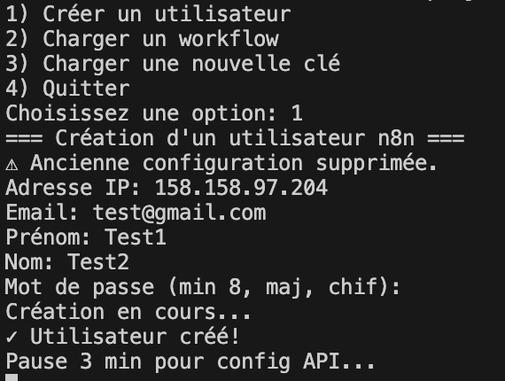

Il vous sera demandé de créer une clée API, pour cela, rendez vous sur l'interface N8N, connectez vous avec les informations configurées précédemment.
En bas à gauche, cliquez sur le profil > "settings":

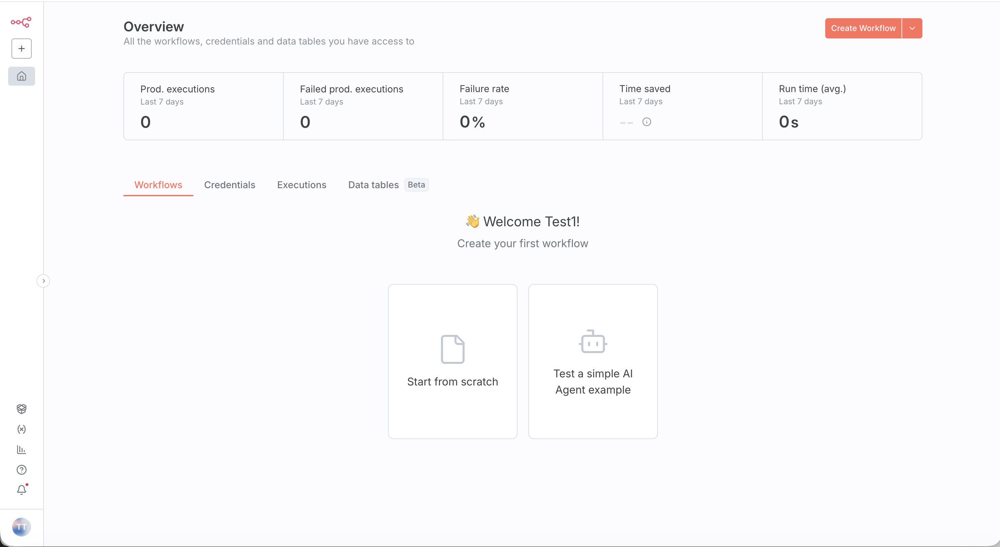
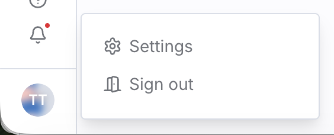

Sur la nouvelle page qui s'ouvre, choisissez "n8n api":

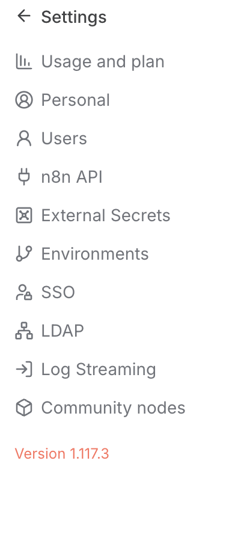

Ensuite, cliquer sur "Create an API Key":
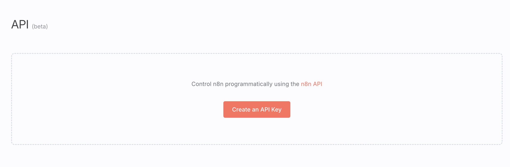

Nommer la clé comme voulu:

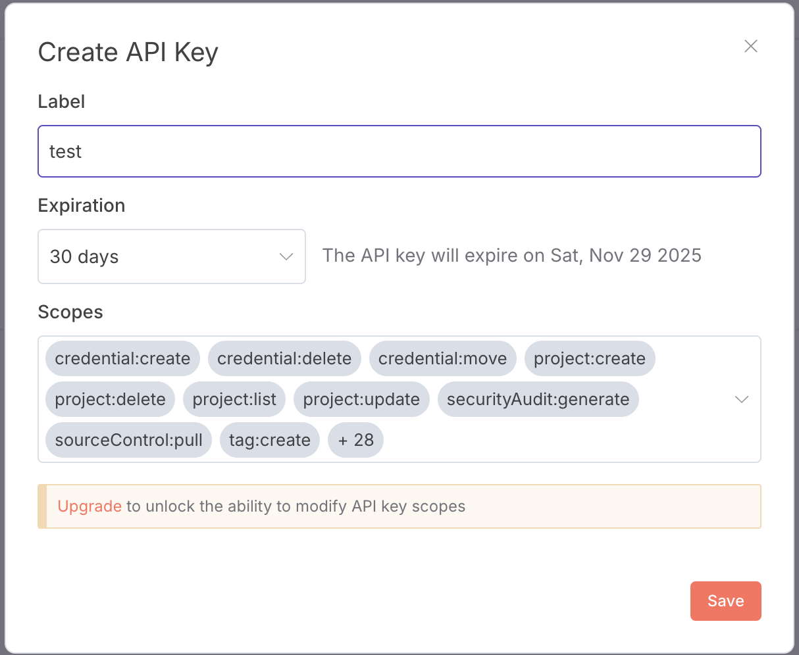

[Etape Importante] Copier la clé API et coller la dans le terminal, une fois le menu fermé, vous ne pourrez plus récupérer la clé API:

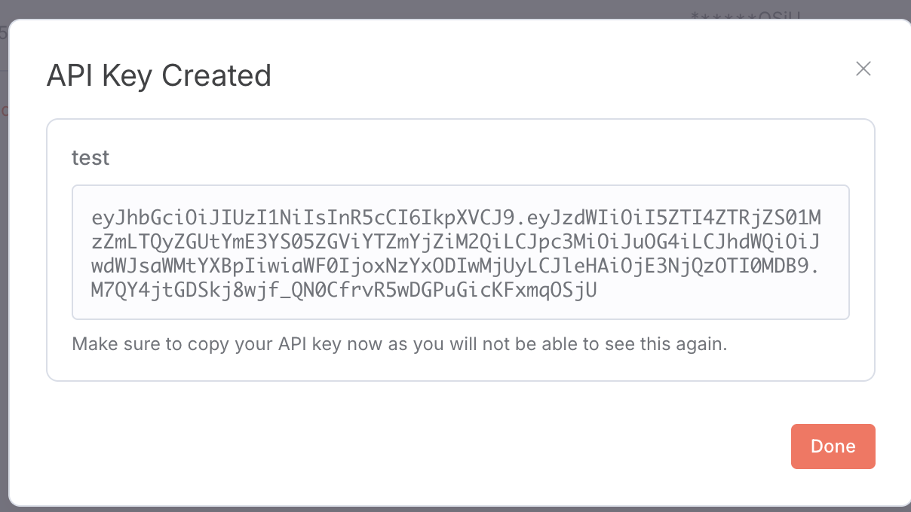
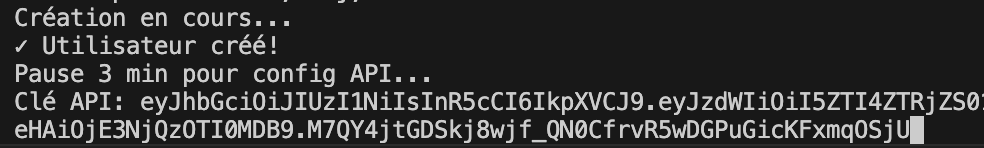

- Option 2 : Charger un workflow
Une fois la clé précédemment chargée, vous pouvez importer les workflow:
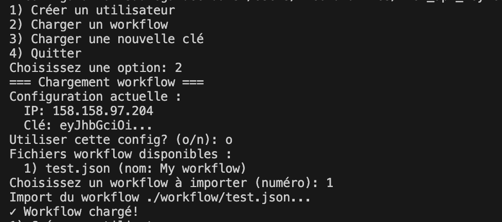

- Option 3 : Charger une nouvelle clé
  
- Option 4 : Quitter

---

## Enchaînement recommandé

### Étape 1 : Déploiement

Lancer le script de création de l’infrastructure Azure :
`./0_create_vm.sh`

Ce script crée la VM, le réseau et les ressources Azure nécessaires.

### Étape 2 : Déploiement de n8n

Lancer le script de déploiement n8n :
`./1_deploy_n8n_azure.sh`

Ce script installe et démarre n8n sur la VM.

### Étape 3 : Configuration

Une fois le service n8n accessible, lancer le script de configuration :
`./2_config_n8n.sh`


Ce script crée un utilisateur administrateur n8n sécurisé et gère les workflows.

---

## Structure du projet

```sh
/
├── 0_create_vm.sh             # Script 1 : crée l’infrastructure Azure (VM, réseau, sécurité)
├── 1_deploy_n8n_azure.sh      # Script 2 : déploie n8n sur la VM
├── 2_config_n8n.sh            # Script 3 : configure n8n (owner, clé API, workflows)
├── workflow/                  # Dossier contenant les workflows JSON à importer
│
	├── workflow1.json│
	├── workflow2.json│
	└── …
└── ~/.ssh/azure_n8n          # Clés SSH générées par le script 1
```


---

## Prérequis

### Script 1 (`0_create_vm.sh`)

- Compte Azure (Azure for Students ou autre)
- Bash (Linux/macOS/WSL)
- Connexion internet

### Script 2 (`1_deploy_n8n_azure.sh`)

- Bash
- `curl` (installé par défaut)

### Script 3 (`2_config_n8n.sh`)

- Bash
- `curl` (installé par défaut)

---

## Résumé des commandes

| Commande | Description |
|----------|-------------|
| `chmod +x 0_create_vm.sh` | Rendre le script de création VM exécutable |
| `./0_create_vm.sh` | Créer l’infrastructure Azure |
| `./0_create_vm.sh --stop` | Arrêter la VM |
| `./0_create_vm.sh --start` | Redémarrer la VM |
| `./0_create_vm.sh --cleanup` | Supprimer toutes les ressources Azure |
| `./0_create_vm.sh --cleanup --force` | Supprimer sans confirmation |
| `chmod +x 1_deploy_n8n_azure.sh` | Rendre le script de déploiement n8n exécutable |
| `./1_deploy_n8n_azure.sh` | Déployer n8n sur la VM |
| `chmod +x 2_config_n8n.sh` | Rendre le script de configuration n8n exécutable |
| `./2_config_n8n.sh` | Configurer n8n (utilisateur, clé API, workflows) |

---

## Important - Sécurité

⚠️ **Attention aux points suivants :**

- **Ports ouverts (22/5678)** → À restreindre en production (firewall, NSG)
- **Pas de HTTPS natif** → Ajouter un reverse proxy + certificats SSL en production
- **Clé SSH privée** → Protéger votre machine et ne jamais partager la clé privée
- **Credentials par défaut** → Changer immédiatement le mot de passe `admin123`

---

## Dépannage

### Le service n8n ne démarre pas

Vérifier les logs cloud-init :
`ssh -i ~/.ssh/azure_n8n devopsadmin@ ‘sudo tail -f /var/log/cloud-init-output.log’`


### Impossible de se connecter en SSH

Vérifier que le NSG autorise votre IP :
`az network nsg rule list –resource-group projet-docker-rg –nsg-name projet-docker-nsg01 -o table`

### Erreur lors du chargement de workflow

Vérifier que la clé API est valide et que le fichier JSON est bien formaté :


---

## Licence

Ce projet est fourni à des fins pédagogiques.


